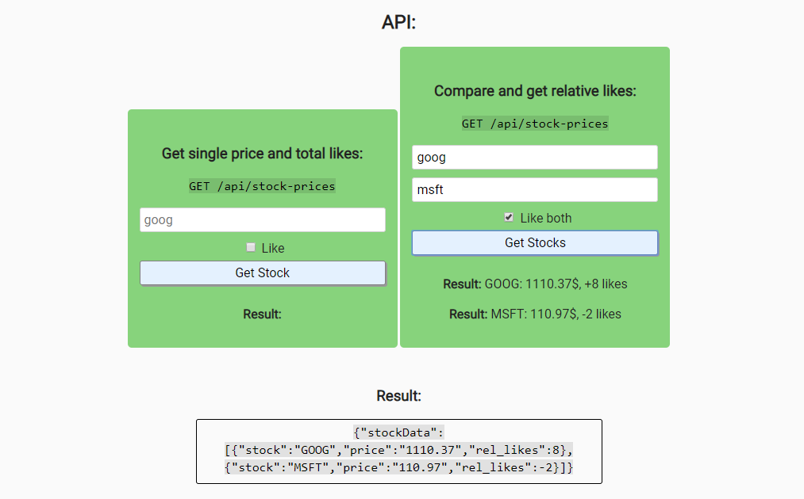

# Stock Price Checker

## Introduction
A price checker for the NASDAQ stock market that displays the current value of one or two stocks.  
Stocks can receive likes and the relative likes for two stocks are displayed.

Testing is done with Chai.

This project is part of freeCodeCamps Information Security and Quality Assurance certificate.

***

## Project Requirements
* The content security policies are set to only allow loading of scripts and css from your server.
* It is possible to GET /api/stock-prices with form data containing a Nasdaq stock ticker and recieve back an object stockData.
* In stockData, I can see the stock (string, the ticker), price (decimal in string format), and likes (integer).
* It is possible to also pass along field like as true (boolean) to have my like added to the stock. Only 1 like per ip should be accepted.
* If 2 stocks are passed along, the return object will be an array with both stock's info but instead of likes, it will display rel_likes (the difference between the likes on both) on both.
* A good way to receive the current price is the following external API: https://api.iextrading.com
* All 5 functional tests are complete and passing.

***

## Project Data
Stock market API:  
https://iextrading.com/developer

## Final Project
https://fcc-infosec-stock-price-checker-fred.glitch.me

***

## Behind the scenes
### Backend:
* Node
* Express
* Mongodb
* Helmet
* Chai

### Database:
* MongoDB

### Hosting:
* Glitch
* mLab

***

## Preview Images
### Main Screen:

